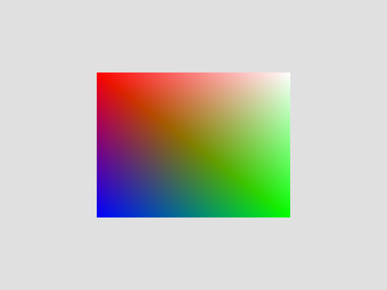

# Nexg(Next GPU)

## **Low-level fast GPU Api**  

)

  

Nexg is a pure-rust library that makes coding Vulkan functionality easier and more Rust-like  

Nexg aims to support gaming applications as well as operation on GPUs  

# Examples
### Triangle
**[Code](https://github.com/Ichinose0/Gallium/blob/main/examples/triangle.rs)**  
  

### Index buffer
**[Code](https://github.com/Ichinose0/Gallium/blob/main/examples/index_buffer.rs)**

# Notice
This API is not **an abstraction** to other graphics APIs (DirectX, Metal).  
It is an API that makes it easier to use and **optimize Vulkan's functionality**.

# Goals
 - Fast API with low overhead

# License
Nexg is licensed under MIT LICENSE
