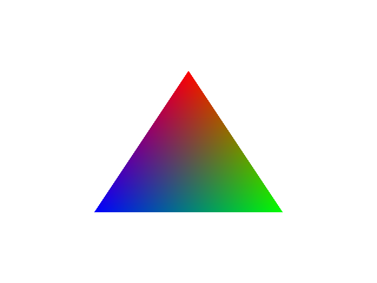

# Gallium - Low-level fast GPU Api

)

  
Gallium is a pure-rust library that makes coding Vulkan functionality easier and more Rust-like  

Gallium aims to support gaming applications as well as operation on GPUs  

# Examples
### Triangle
[Code](https://github.com/Ichinose0/Gallium/blob/main/examples/triangle.rs)

# Notice
This API is not **an abstraction** to other graphics APIs (DirectX, Metal).  
It is an API that makes it easier to use and **optimize Vulkan's functionality**.

# Goals
 - Fast API with low overhead

# License
Gallium is licensed under MIT LICENSE
